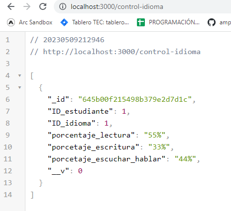
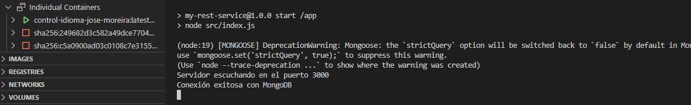

# My REST Service

Este es un servicio REST básico construido con Node.js y Express.

## Requisitos

- Node.js
- NPM

## Instalación

1. Clonar el repositorio: `git clone https://github.com/your-username/my-rest-service.git`
2. Ir al directorio del proyecto: `cd my-rest-service`
3. Instalar las dependencias: `npm install`

## Uso

Para iniciar el servicio, correr el comando: `npm start`

El servicio estará disponible en `http://localhost:3000`.



### Endpoints

- `GET /control-idioma`: Obtiene todos los libros
- `GET /control-idioma/:id`: Obtiene un libro por su ID
- `POST /control-idioma`: Crea un nuevo libro
- `PUT /control-idioma`: Actualiza un libro
- `DELETE /control-idioma`: Elimina un libro

### Ejemplo de solicitud HTTP

```
POST /control-idioma HTTP/1.1
Host: localhost:3000
Content-Type: application/json


{
    "ID_estudiante": 1,
    "ID_idioma": 1,
    "porcentaje_lectura": "55%",
    "porcetaje_escritura":  "33%",
    "porcetaje_escuchar_hablar": "44%"

}
```

## Pruebas

Para correr las pruebas, correr el comando: `npm test`


## Contribuciones

Las contribuciones son bienvenidas. Por favor, asegúrese de seguir los estándares de código y las guías de estilo.

## Licencia

Este proyecto está bajo la Licencia MIT. Ver el archivo LICENSE para más detalles.

## Dockerización

Se ha utilizado Docker para la dockerización del servicio REST y sus pruebas. Se han creado dos tags en la imagen:



```
docker build -t control-idioma-jose-moreira:latest .
docker run -p 3000:3000 control-idioma-jose-moreira:latest

docker build -t control-idioma-jose-moreira:test .
docker run -p 3000:3000 control-idioma-jose-moreira:test
```

## Uso de la imagen

La imagen de Docker se encuentra disponible en Docker Hub con los siguientes nombres:

```
velezdavid/kma-notas-nodejs:rest: contiene la imagen del servicio REST.
velezdavid/kma-notas-nodejs:test: contiene la imagen con las pruebas unitarias del servicio REST.
```

Para ejecutar la imagen se puede utilizar el siguiente comando:

```
docker run -p 3000:3000 velezdavid/kma-notas-nodejs:rest
```


