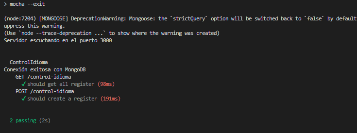

# My REST Service

Este es un servicio REST básico construido con Node.js y Express.

## Requisitos

- Node.js
- NPM

## Instalación

1. Clonar el repositorio: `git clone https://github.com/your-username/my-rest-service.git`
2. Ir al directorio del proyecto: `cd my-rest-service`
3. Instalar las dependencias: `npm install`

## Uso

Para iniciar el servicio, correr el comando: `npm start`

El servicio estará disponible en `http://localhost:3000`.


### Endpoints

- `GET /books`: Obtiene todos los libros
- `GET /books/:id`: Obtiene un libro por su ID
- `POST /books`: Crea un nuevo libro

### Ejemplo de solicitud HTTP

```
POST /books HTTP/1.1
Host: localhost:3000
Content-Type: application/json

{
    "title": "Mi libro",
    "author": "Yo mismo",
    "year": 2021
}
```

## Pruebas

Para correr las pruebas, correr el comando: `npm test`



## Contribuciones

Las contribuciones son bienvenidas. Por favor, asegúrese de seguir los estándares de código y las guías de estilo.

## Licencia

Este proyecto está bajo la Licencia MIT. Ver el archivo LICENSE para más detalles.

## Dockerización

Se ha utilizado Docker para la dockerización del servicio REST y sus pruebas. Se han creado dos tags en la imagen:


```
docker build -t books-jose-moreira:latest .
docker run -p 3000:3000 books-jose-moreira:latest

docker build -t books-jose-moreira:test .
docker run -p 3000:3000 books-jose-moreira:test
```
